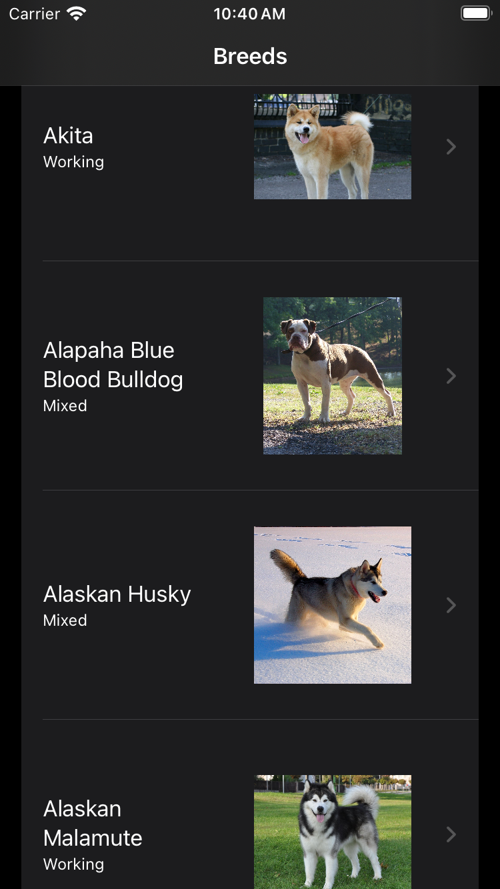
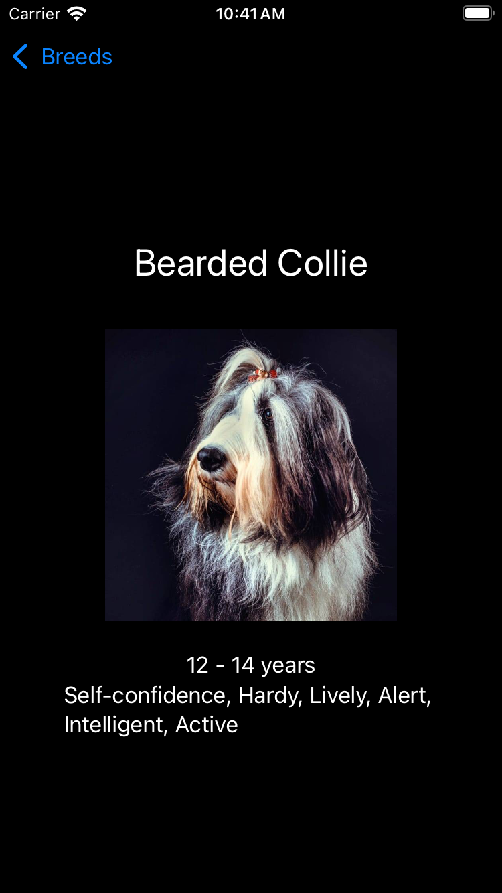

DogFancy
===========

 

### Description

DogFancy demonstrates the sort of app that a candidate for an iOS-development job might be expected to implement in forty-five minutes. [This YouTube video](https://www.youtube.com/watch?v=iPoll8fg2XE) shows me implementing DogFancy. [This blog post](https://www.racecondition.software/blog/live-challenges/) describes my preparation for this implementation.

DogFancy gets dog-breed data from [The Dog API](https://www.thedogapi.com), which is fantastic. To run DogFancy, get an API key from The Dog API and replace `API_KEY` in `BreedLoader.swift` with that API key.

### Screenshots

| Browsing | Details |
| -------- | ------- |
|  |  |

### Credits

Vincent Pradeilles [inspired](https://www.youtube.com/watch?v=n1PeOa3qXy8&t=3s) DogFancy's use of a view model for loading state.

Donny Wals [shared](https://www.donnywals.com/using-swifts-async-await-to-build-an-image-loader/) DogFancy's approach to image caching. I simplified this approach considerably while practicing DogFancy's implementation.

The humorous badges at the top of this readme are from my [curated list](https://github.com/vermont42/Podcasts) of iOS-development podcasts.

I created DogFancy's app icon using Apple's [Image Playground](https://apps.apple.com/us/app/image-playground/id6479176117).
